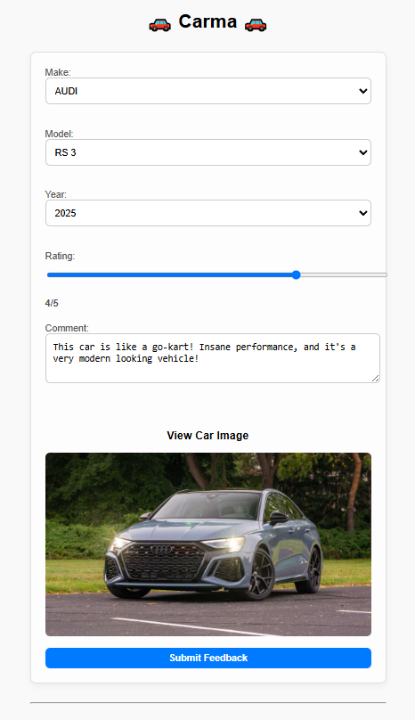

# 🚗 Carma - Crowdsourced Car Feedback Application
<p align="center">
  
</p>

**Carma** is a full-stack web app where users can look up car makes an dmodels using the [NHTSA Vehicle API](https://vpic.nhtsa.dot.gov/api/) and submit their own
personal review about vehicles. This application is built with the **MERN** stack and designed to meet all requirements of the Canadian Sheep Federation Internship Assignment

---

## 📸 Preview

### Feedback Form



### Feedback List


---

## ✅ Features

### API Functionality (Back-End)

- Built with **Node.js**, **Express**, and **MongoDB (Mongoose)**
- RESTful endpoints:
  - `POST /api/feedback`: Create a new feedback entry
  - `GET /api/feedback/:id`: Retrieve a feedback entry by ID
  - `GET /api/feedback`: Retrieve all feedback entries
- Stores vehicle `make`, `model`, `year`, `rating (1–5)`, and `comment`
- Automatically timestamps entries

### Web App Functionality (Front-End)

- Built with **React**
- Fetches car make/model data from the **NHTSA Vehicle API**
- Interactive form with:
  - Make & model dropdowns
  - Year selector
  - 1–5 star rating input
  - Text feedback field
- Displays a preview image or link to search the selected car
- Shows a list of all previously submitted feedback

---

## 📁 Technologies Used

- **Frontend**: React, Axios, TailwindCSS (or basic CSS)
- **Backend**: Express, Node.js, Mongoose
- **Database**: MongoDB Atlas (cloud)
- **Public API**: [NHTSA Vehicle API](https://vpic.nhtsa.dot.gov/api/)

---

## 🚀 Getting Started

### 1. Clone the project

```bash
git clone https://github.com/goshanraj-g/carma.git

```

### 2. Backend Setup

```bash
cd backend
npm install
# Create a .env with:
# .env
PORT=5000
MONGO_URI=mongodb+srv://<your-uri>
```

### 3. Frontend Setup

```bash
cd frontend
npm install
```

### 4. Startup

```bash
# STARTUP
# Start backend with npm run dev
# Start frontend with npm start

# Visit http://localhost:3000
```

## 🧪 Example cURL Requests

### Create feedback

```bash
curl -X POST http://localhost:5000/api/feedback \
  -H "Content-Type: application/json" \
  -d '{
    "make": "audi",
    "model": "RS 3",
    "year": 2022,
    "rating": 5,
    "comment": "Very good performance and sleek design."
}'
```

### Get all feedback

```bash
curl http://localhost:5000/api/feedback
```

### Get specific feedback by ID

```bash
curl http://localhost:5000/api/feedback/<id>
```
