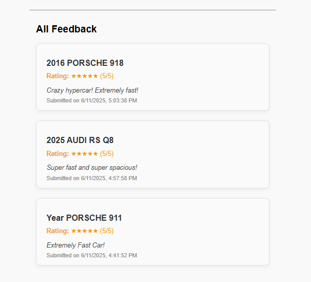

# 🚗 Carma - Crowdsourced Car Feedback Application

<p align="center">
  
</p>

**Carma** is a full-stack web app where users can look up car makes an dmodels using the [NHTSA Vehicle API](https://vpic.nhtsa.dot.gov/api/) and submit their own
personal review about vehicles. This application is built with the **MERN** stack and designed to meet all requirements of the Canadian Sheep Federation Internship Assignment

---

## 📸 Preview

### Feedback Form


### Feedback List



---

## ✅ Features

### API Functionality (Back-End)

- Built with **Node.js**, **Express**, and **MongoDB (Mongoose)**
- RESTful endpoints:
  - `POST /api/feedback`: Create a new feedback entry
  - `GET /api/feedback/:id`: Retrieve a feedback entry by ID
  - `GET /api/feedback`: Retrieve all feedback entries
- Stores vehicle `make`, `model`, `year`, `rating (1–5)`, and `comment`
- Automatically timestamps entries

### Web App Functionality (Front-End)

- Built with **React**
- Fetches car make/model data from the **NHTSA Vehicle API**
- Interactive form with:
  - Make & model dropdowns
  - Year selector
  - 1–5 star rating input
  - Text feedback field
- Displays a preview image or link to search the selected car
- Shows a list of all previously submitted feedback

---

## 📁 Technologies Used

- **Frontend**: React, Axios, TailwindCSS (or basic CSS)
- **Backend**: Express, Node.js, Mongoose
- **Database**: MongoDB Atlas (cloud)
- **Public API**: [NHTSA Vehicle API](https://vpic.nhtsa.dot.gov/api/)

---

# How Can the Application and API be Extended and Improved?

- User Authentication
  - Adding login support with Google OAuth would allow it so individuals can manage their own feedback, and possibly avoid spam.
  - Allow users to view their personal feedback history, edit it, delete it
- Enhanced Filtering and Browsing
  - Add filters and search functionalities for vehicles
  - Add Make / Model / Year / Rating filters
  - Allow full-text search on comments
  - Sort by highest-rated, most reviewed, etc...
- Pagination
  - Load feedback entries 10 at a time to improve website performance and reduce frontend load time
- Ratings Aggregations/Visuals
  - Display aggregated data such as average rating per model/year or number of reviews that were submitted
- Image Integration
  - Instead of just linking a Google Images Link, I could implement an auto-fetching car API or even use Unsplash API or Car Imagery API
  - Show a live thumbnail preview in the splashcard as users adding feedback to ensure they are reviewing the right car
- Responsive UI
  - I could have improved the mobile interface by optimizing font sizes, and using mobile-friendly dropdowns
- Improved Input Validation
  - Possibly validate incoming request bodies using a library like express-validator
- Rate Limiting & Bot Prevention
  - Prevent abuse/spam using reCAPTCHA, or express-rate-limit
  - Could implement it so theres a limit of 5 submissions per minute per IP

# How Can the Application and API be Deployed?

- Backend Deployment
  - The Express API can be reployed on Render or Railway
  - The environmental variables have to be set securely on the dashboard
  - Example: `https://carma-api.onrender.com/api/feedback`
- Frontend Deployment
  - Host the React app with Vercel, GitHub Pages or Netlify
  - This could be automatically built and deployed from GitHub using CI/CD
- Database Hosting
  - MongoDB Atlas could be utilized to host a secure, scalable cloud database
  - Can be securely connected with a connection string in the backend .env
- Other Future Improvements with Deployment
  - Add domain name (carma.ca/carma.app) and link the frontend + backend with the same subdomain
  - Enable HTTPS with automatic SSL

## 🚀 Getting Started

### 1. Clone the project

```bash
git clone https://github.com/goshanraj-g/carma.git

```

### 2. Backend Setup

```bash
cd backend
npm install
# Create a .env with:
# .env
PORT=5000
MONGO_URI=mongodb+srv://<your-uri>
```

### 3. Frontend Setup

```bash
cd frontend
npm install
```

### 4. Startup

```bash
# STARTUP
# Start backend with npm run dev
# Start frontend with npm start

# Visit http://localhost:3000
```

## 🧪 Example cURL Requests

### Create feedback

```bash
curl -X POST http://localhost:5000/api/feedback \
  -H "Content-Type: application/json" \
  -d '{
    "make": "audi",
    "model": "RS 3",
    "year": 2022,
    "rating": 5,
    "comment": "Very good performance and sleek design."
}'
```

### Get all feedback

```bash
curl http://localhost:5000/api/feedback
```

### Get specific feedback by ID

```bash
curl http://localhost:5000/api/feedback/<id>
```
